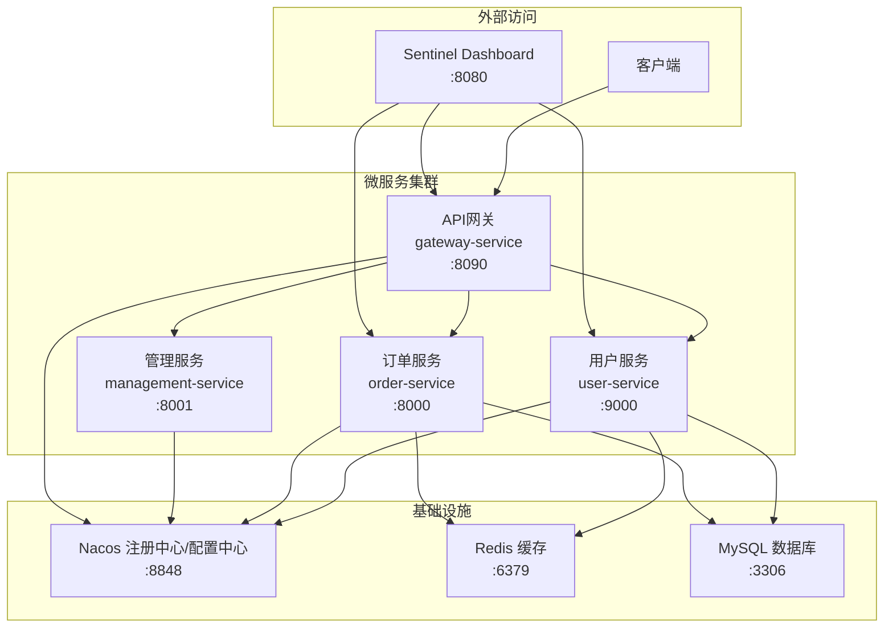

# CloudDemo 微服务项目说明文档

[](https://spring.io/projects/spring-boot)
[](https://spring.io/projects/spring-cloud)
[](https://nacos.io/)
[](https://dubbo.apache.org/)
[](https://sentinelguard.io/)

## 📋 目录

- [项目概述](#项目概述)
- [系统架构](#系统架构)
- [服务端口分配](#服务端口分配)
- [核心技术栈](#核心技术栈)
- [AI专用接口](#ai专用接口)
- [配置管理规范](#配置管理规范)
- [项目结构](#项目结构)
- [快速开始](#快速开始)

## 🚀 项目概述

**CloudDemo** 是基于 Spring Boot + Spring Cloud Alibaba 技术栈构建的分布式微服务学习项目，旨在展示现代微服务架构的核心技术和最佳实践。

### 📊 项目特色

- ✅ **现代化技术栈**：Spring Boot 3.3.4 + Spring Cloud 2023.0.3
- ✅ **阿里巴巴生态**：Nacos + Dubbo + Sentinel 完整解决方案
- ✅ **服务治理完整**：注册发现、配置管理、熔断降级、负载均衡
- ✅ **工程化实践**：统一网关、分布式缓存、JWT认证
- ✅ **AI友好设计**：专用管理接口，便于自动化操作

## 🏗️ 系统架构



## 🔌 服务端口分配

| 服务                     | 端口     | 状态     | 描述          |
|------------------------|--------|--------|-------------|
| **Nacos**              | `8848` | 🟢 运行中 | 注册中心/配置中心   |
| **Sentinel Dashboard** | `8080` | 🟢 运行中 | 熔断降级监控面板    |
| **Gateway Service**    | `8090` | 🟢 运行中 | API网关统一入口   |
| **User Service**       | `9000` | 🟢 运行中 | 用户服务        |
| **Order Service**      | `8000` | 🟢 运行中 | 订单服务        |
| **Management Service** | `8001` | 🟢 运行中 | 管理服务 (AI专用) |
| **Redis**              | `6379` | 🟢 运行中 | 分布式缓存       |
| **MySQL**              | `3306` | 🟢 运行中 | 关系型数据库      |

## 🛠️ 核心技术栈

### 框架技术

| 技术                   | 版本         | 作用        |
|----------------------|------------|-----------|
| Spring Boot          | 3.3.4      | 应用框架      |
| Spring Cloud         | 2023.0.3   | 微服务框架     |
| Spring Cloud Alibaba | 2023.0.1.2 | 阿里巴巴微服务套件 |

### 微服务治理

| 技术                   | 版本     | 作用        |
|----------------------|--------|-----------|
| Nacos Discovery      | 2.5    | 服务注册发现    |
| Nacos Config         | 2.5    | 统一配置管理    |
| Apache Dubbo         | 3.2.15 | 高性能RPC框架  |
| Sentinel             | Latest | 熔断降级/流量控制 |
| Spring Cloud Gateway | Latest | API网关     |

### 数据存储

| 技术           | 版本     | 作用     |
|--------------|--------|--------|
| MySQL        | 8.0+   | 关系型数据库 |
| MyBatis Plus | 3.5.12 | ORM框架  |
| Redis        | 6.0+   | 分布式缓存  |

### 安全认证

| 技术              | 版本     | 作用      |
|-----------------|--------|---------|
| JWT             | Latest | Token认证 |
| Spring Security | 3.3.4  | 安全框架    |

## 🤖 AI专用接口

管理服务 (`management-service`) 提供了专门的API接口供AI使用：

### 🔗 基础访问地址

```
http://localhost:8001
```

### 📋 接口列表

#### 1. 配置管理接口

| 接口     | 方法    | 路径                                  | 描述                |
|--------|-------|-------------------------------------|-------------------|
| 同步所有配置 | `GET` | `/api/config/sync-all`              | 同步所有服务的Nacos配置到本地 |
| 同步指定配置 | `GET` | `/api/config/sync/{serviceName}`    | 同步指定服务的配置         |
| 配置文件列表 | `GET` | `/api/config/list`                  | 获取所有已同步的配置文件列表    |
| 配置文件内容 | `GET` | `/api/config/content/{serviceName}` | 获取指定服务的配置内容       |

#### 2. 服务状态接口

| 接口        | 方法    | 路径                           | 描述              |
|-----------|-------|------------------------------|-----------------|
| 服务运行状态    | `GET` | `/api/services/status`       | 获取所有微服务的运行状态    |
| Nacos注册状态 | `GET` | `/api/services/nacos-status` | 获取Nacos中的服务注册信息 |

#### 3. 系统信息接口

| 接口   | 方法    | 路径                 | 描述           |
|------|-------|--------------------|--------------|
| 系统信息 | `GET` | `/api/system/info` | 获取JVM和系统环境信息 |
| 健康检查 | `GET` | `/api/health`      | 验证管理服务运行状态   |

### 💡 使用示例

```bash
# 同步所有服务配置
curl -X GET "http://localhost:8001/api/config/sync-all"

# 获取用户服务配置
curl -X GET "http://localhost:8001/api/config/content/user-service"

# 检查所有服务状态
curl -X GET "http://localhost:8001/api/services/status"

# 查看系统信息
curl -X GET "http://localhost:8001/api/system/info"
```

### 📝 响应格式

所有接口统一返回JSON格式：

```json
{
  "code": 200,
  "message": "操作成功",
  "data": {...},
  "success": true,
  "timestamp": "2025-07-21T10:30:00"
}
```

## 📁 项目结构

```
cloudDemo/                           # 父项目
├── pom.xml                          # 父项目依赖管理
├── services/                        # 微服务模块
│   ├── pom.xml                      # 服务模块父pom
│   ├── common-api/                  # 公共API模块
│   │   ├── src/main/java/com/cloudDemo/api/
│   │   │   ├── dto/                 # 数据传输对象
│   │   │   ├── service/             # 接口定义
│   │   │   └── util/                # 工具类
│   │   └── pom.xml
│   ├── user-service/                # 用户服务 :9000
│   │   ├── src/main/java/com/cloudDemo/userservice/
│   │   │   ├── controller/          # REST控制器
│   │   │   ├── service/             # 业务逻辑
│   │   │   ├── mapper/              # 数据访问
│   │   │   ├── entity/              # 实体类
│   │   │   ├── config/              # 配置类
│   │   │   └── fallback/            # Sentinel降级
│   │   ├── src/main/resources/
│   │   │   └── application.properties
│   │   └── pom.xml
│   ├── order-service/               # 订单服务 :8000
│   │   ├── src/main/java/com/cloudDemo/orderservice/
│   │   │   ├── controller/          # 订单控制器
│   │   │   ├── service/             # 订单业务逻辑
│   │   │   ├── mapper/              # 数据访问
│   │   │   ├── entity/              # 订单实体
│   │   │   └── fallback/            # 降级处理
│   │   └── pom.xml
│   ├── gateway-service/             # API网关 :8090
│   │   ├── src/main/java/com/cloudDemo/gateway/
│   │   │   ├── config/              # 网关配置
│   │   │   └── filter/              # 自定义过滤器
│   │   ├── src/main/resources/
│   │   │   └── application.yml
│   │   └── pom.xml
│   └── management-service/          # 管理服务 :8001
│       ├── src/main/java/com/cloudDemo/management/
│       │   ├── controller/          # 管理接口
│       │   ├── service/             # 配置管理逻辑
│       │   └── config/              # 配置类
│       ├── config-templates/        # Nacos同步的配置
│       ├── config-templates-modified/ # 修改后的配置
│       └── pom.xml
├── logs/                            # 服务日志文件
├── *.sql                           # 数据库脚本
├── *.http                          # API测试文件
├── *.md                            # 项目文档
└── 项目说明.txt                     # 项目说明文档
```

## ⚙️ 配置管理规范

> ⚠️ **重要**：为确保配置一致性，请严格遵循以下流程

### 🔄 标准操作流程

#### 步骤1️⃣：配置同步

```bash
# 同步所有服务配置到本地
curl -X GET "http://localhost:8001/api/config/sync-all"

# 或同步特定服务配置
curl -X GET "http://localhost:8001/api/config/sync/user-service"
```

#### 步骤2️⃣：差异对比

- 对比 `config-templates/` 中的Nacos配置
- 与项目中的本地配置文件进行比较
- 识别需要更新的配置项

#### 步骤3️⃣：配置验证

- ✅ 检查配置文件语法
- ✅ 验证配置项格式和数值
- ✅ 确认不会导致服务启动失败

#### 步骤4️⃣：人工确认

- 🚫 **禁止AI直接修改Nacos配置**
- ✅ AI提供配置更新建议
- ✅ 人工确认后手动上传到Nacos

### 📂 配置文件路径

```
配置同步目录：
├── services/management-service/config-templates/     # Nacos原始配置
└── services/management-service/config-templates-modified/ # 修改后配置

各服务本地配置：
├── services/user-service/src/main/resources/application.properties
├── services/order-service/src/main/resources/application.properties
├── services/gateway-service/src/main/resources/application.yml
└── services/management-service/src/main/resources/application.properties
```

### 🛡️ 安全注意事项

- ⚠️ Nacos配置具有最高优先级，会覆盖本地配置
- ⚠️ 配置错误可能导致服务无法启动
- ⚠️ 修改共享配置需考虑对其他服务的影响
- ✅ 建议先在测试环境验证配置修改

## 🚀 快速开始

### 1. 环境要求

- ☕ JDK 17+
- 📦 Maven 3.6+
- 🐳 Docker (可选)
- 💾 MySQL 8.0+
- 🔴 Redis 6.0+

### 2. 启动顺序

```bash
# 1. 启动基础设施
# - MySQL 数据库
# - Redis 缓存
# - Nacos (端口:8848)

# 2. 启动微服务
cd services/management-service && mvn spring-boot:run   # :8001
cd services/user-service && mvn spring-boot:run        # :9000  
cd services/order-service && mvn spring-boot:run       # :8000
cd services/gateway-service && mvn spring-boot:run     # :8090

# 3. 启动监控 (可选)
# Sentinel Dashboard 启动脚本 (端口:8080)
```

### 3. 验证服务

```bash
# 检查所有服务状态
curl "http://localhost:8001/api/services/status"

# 通过网关访问用户服务
curl "http://localhost:8090/user/list"

# 查看Sentinel监控
open http://localhost:8080
```

## 📚 相关文档

- 📄 [Sentinel熔断降级集成完成报告](./Sentinel熔断降级集成完成报告.md)
- 📄 [订单模块Sentinel测试报告](./订单模块Sentinel测试报告.md)
- 📄 [网关服务启动成功报告](./网关服务启动成功报告.md)
- 📄 [Dubbo负载均衡配置验证完成报告](./Dubbo负载均衡配置验证完成报告.md)
- 📄 [技术组件集成计划书](./技术组件集成计划书-一年经验优化版.md)

## 🎯 项目亮点

### 🏆 技术实现

- ✅ **服务治理完整**：注册发现、配置管理、负载均衡、熔断降级
- ✅ **高可用设计**：多级缓存、服务降级、健康检查
- ✅ **现代化架构**：响应式网关、异步处理、事件驱动
- ✅ **工程化实践**：统一异常处理、参数校验、接口文档

### 📊 性能优化

- ⚡ Dubbo高性能RPC调用
- 💾 Redis分布式缓存策略
- 🔄 连接池和线程池优化
- 📈 JVM参数调优配置

### 🔐 安全特性

- 🔑 JWT Token认证机制
- 🛡️ 接口权限控制
- 🚫 SQL注入防护
- 📝 操作日志审计

---

## 📞 联系信息

- **项目状态**: 🚧 开发中
- **最后更新**: 2025年7月21日
- **技术支持**: 查阅相关技术文档或README文件

---

<div align="center">

**CloudDemo 微服务项目** | Built with ❤️ using Spring Cloud Alibaba

</div>
